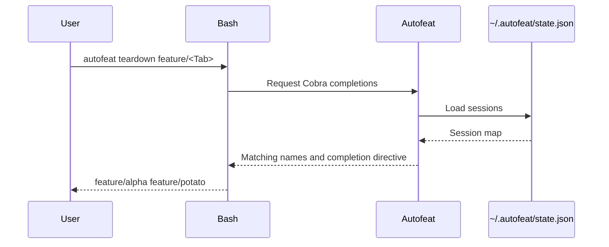

# Bash autocomplete

## Overview

The Cobra command tree defines commands, flags, and dynamic completion
callbacks. Cobra generates the Bash integration script and handles completion
requests at runtime.



## Generating The Script

Generate the integration script with:

```bash
autofeat completion bash
```

Cobra derives the script from the same command tree used to execute commands.
There is no separately maintained Bash parser or embedded completion asset.

## Shell Startup

The installer adds this to `.bashrc`:

```bash
source <(autofeat completion bash)
```

That behavior is implemented in `install-linux.sh`.

When Bash starts:

1. `autofeat completion bash` asks Cobra to generate the script.
2. `<(...)` exposes that output as a temporary readable stream.
3. `source` evaluates it in the current shell.
4. Cobra's generated function registers completion for `autofeat`.

## Finding Feature Names

The generated script sends the partially typed command to Cobra's hidden
completion protocol. The matching command's completion callback:

1. Calls `state.ListSessions()`.
2. Removes feature names already selected on the command line.
3. Filters by the current prefix.
4. Sorts and returns the remaining names with a no-file-completion directive.

`state.ListSessions()` reads `$HOME/.autofeat/state.json` through state.go. A missing state file represents an empty
session map.

This completion path performs no Git commands, fetching, drift calculation, or worktree inspection. Feature suggestions
therefore remain inexpensive and offline.

## Context Filtering

The Bash function understands these contexts:

* Top-level command names.
* Active feature names for `new`, `remove`, `open`, `run`, `sync`, `status`,
  and `teardown`.
* `--local`, `--remote`, and `--force` for `remove`.
* `--copilot` for `open`.
* `--force` for `teardown`.
* `--task` for `run`.
* `bash` and `powershell` after `autofeat completion`.

Already-selected feature names are removed. Thus:

```bash
autofeat teardown feature/alpha <Tab>
```

will not suggest `feature/alpha` again.

For `new`, active names support adding another repository to an existing
feature. A feature name that has not been created yet remains free-form and is
not available as a completion candidate.

When the cursor is immediately after `--task`, the callback returns no feature
suggestions because that position expects a free-form value.

## Failure Behavior

Dynamic callbacks intentionally convert state or template loading failures into
an empty completion result. Therefore:

* Missing state produces no feature candidates.
* Malformed or unreadable state also produces no candidates or terminal noise.
* Cobra may still offer command-specific options independently.

Completion is advisory only. When Enter is pressed, the normal command path reloads state and validates selectors
through `runSelectedFeatures` and `selectFeatureNames` in main.go. Wildcard selectors such as `"feature/*"` are resolved
there, not by the completion script.

`remove` accepts one exact feature name instead of a selector. Its command path
then resolves the required local path or remote URL against that session.

## Tests

Coverage in main_test.go verifies:

* Sorted feature callbacks and duplicate filtering.
* Empty and malformed state.
* Generated Bash syntax using `bash -n`.
* Cobra's hidden completion protocol and directives.
* Template prefix completion.
