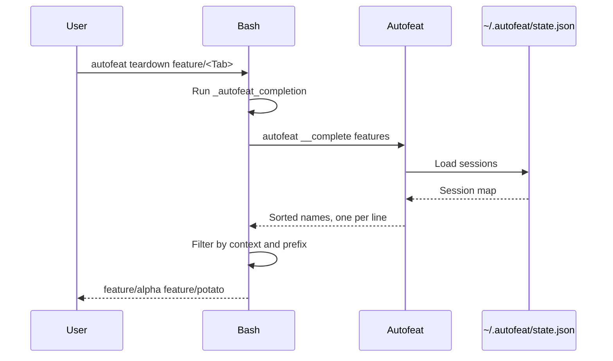

# Bash autocomplete

## Overview

The feature is split into two parts:

* Go provides the completion script and authoritative feature names.
* Bash examines the partially typed command and decides which candidates to show.



## Embedding The Script

The Bash code lives in completion.bash, but it is compiled into the Go binary:

```go
//go:embed completion.bash
var bashCompletion string
```

This is in main.go. The blank import of Go’s `embed` package enables that directive.

Consequently, the installed binary remains self-contained. It does not need a separate completion file at runtime.

Running:

```bash
autofeat completion bash
```

dispatches through main.go and writes the embedded script to standard output through `writeBashCompletion`.

## Shell Startup

The installer adds this to `.bashrc`:

```bash
source <(autofeat completion bash)
```

That behavior is implemented in install.sh.

When Bash starts:

1. `autofeat completion bash` prints the embedded script.
2. `<(...)` exposes that output as a temporary readable stream.
3. `source` evaluates it in the current shell.
4. The script registers `_autofeat_completion` for four commands:

```bash
complete -F _autofeat_completion autofeat af afl
```

The function must run inside the current shell because Bash supplies completion state through special variables.

## Bash Completion State

When Tab is pressed, Bash calls `_autofeat_completion` from completion.bash.

The important Bash variables are:

* `COMP_WORDS`: all words currently on the command line.
* `COMP_CWORD`: index of the word being completed.
* `COMPREPLY`: array that the function fills with suggestions.

For example:

```text
autofeat teardown feature/
```

roughly produces:

```bash
COMP_WORDS=(autofeat teardown feature/)
COMP_CWORD=2
```

The function reads `feature/` as the current prefix and eventually fills `COMPREPLY` with matching active features.

## Finding Feature Names

The Bash function runs:

```bash
command autofeat __complete features
```

`command` bypasses aliases and shell functions, ensuring the real executable is called.

The hidden `__complete features` command dispatches to `writeFeatureCompletions` in main.go. That function:

1. Calls `state.ListSessions()`.
2. Extracts the session-map keys.
3. Sorts them.
4. Prints one feature name per line.

`state.ListSessions()` reads `$HOME/.autofeat/state.json` through state.go. A missing state file represents an empty
session map.

This completion path performs no Git commands, fetching, drift calculation, or worktree inspection. Feature suggestions
therefore remain inexpensive and offline.

## Context Filtering

The Bash function understands these contexts:

* Top-level command names.
* Feature names for `open`, `run`, `sync`, `status`, and `teardown`.
* `--force` for `teardown`.
* `-task` for `run`.
* `bash` after `autofeat completion`.

It also handles aliases specially:

* `af` behaves like `autofeat`.
* `afl` starts in `list` context.

Already-selected feature names are removed. Thus:

```bash
autofeat teardown feature/alpha <Tab>
```

will not suggest `feature/alpha` again.

When the cursor is immediately after `-task`, the function returns no feature
suggestions because that position expects a free-form value.

## Failure Behavior

The feature lookup redirects errors:

```bash
command autofeat __complete features 2>/dev/null
```

Therefore:

* Missing state produces no feature candidates.
* Malformed or unreadable state also produces no candidates or terminal noise.
* Command-specific options may still be offered independently.

Completion is advisory only. When Enter is pressed, the normal command path reloads state and validates selectors
through `runSelectedFeatures` and `selectFeatureNames` in main.go. Wildcard selectors such as `"feature/*"` are resolved
there, not by the completion script.

## Tests

Coverage in main_test.go verifies:

* Sorted feature output.
* Empty and malformed state.
* Generated Bash syntax using `bash -n`.
* Prefix completion.
* Slash-containing feature names.
* Multiple selectors and duplicate filtering.
* Contextual options.
* Aliases.
* Silent endpoint failures.
