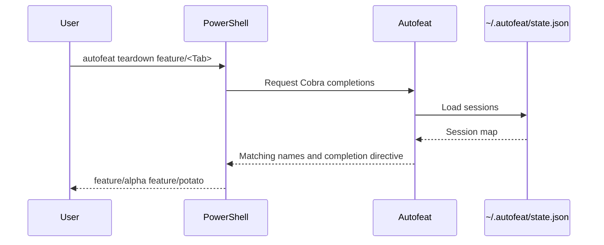

# PowerShell autocomplete

## Overview

The Cobra command tree defines commands, flags, and dynamic completion
callbacks. Cobra generates the PowerShell integration script and handles
completion requests at runtime.



## Generating The Script

  Generate the integration script with:

```powershell
autofeat completion powershell
```

Cobra derives the script from the same command tree used to execute commands.
There is no separately maintained PowerShell parser or embedded completion
asset.

## Shell Startup

The Windows installer adds this line to the current user's PowerShell 7
all-hosts profile:

```powershell
(& autofeat completion powershell) -join "`n" | Invoke-Expression
```

The profile defaults to `Documents\PowerShell\profile.ps1`, using Windows' known
Documents folder so redirected locations such as OneDrive are respected. This
target does not change when the installer is launched from Windows PowerShell
5.1. Set `PROFILE_PATH` to override it.

At startup, PowerShell 7 evaluates the generated script and registers a native
argument completer for `autofeat`. The installer adds the line only once.
Restart PowerShell 7 or dot-source the profile path printed by the installer
after installation.

For manual setup, add the same line to the profile returned by:

```powershell
$PROFILE.CurrentUserAllHosts
```

## Dynamic Values

The generated completer sends the partially typed command to Cobra's hidden
completion protocol. Autofeat callbacks read local state and templates, filter
values by the current prefix, omit already selected feature names, and return
the matching values. Completion performs no fetching or worktree mutation.
Loading failures are suppressed and produce no dynamic candidates.

The completer supports:

* Top-level commands and completion shell names.
* Active feature names for `remove`, `open`, `run`, `sync`, `status`, and `teardown`.
* Template names and template subcommands.
* Contextual `--local`, `--remote`, `--template`, `--ref`, `--copilot`,
  `--force`, and `--task` options.
* Duplicate filtering for feature selectors and already-used options.

## Troubleshooting

Verify that the profile contains the installer line and is loaded:

```powershell
Test-Path $PROFILE.CurrentUserAllHosts
. $PROFILE.CurrentUserAllHosts
```

If profile execution is blocked, inspect the active policies with:

```powershell
Get-ExecutionPolicy -List
```

Choose an execution policy appropriate for the machine's security requirements;
the installer does not modify execution policy.

## Tests

Go tests generate and execute the Cobra script under PowerShell when available.
They also verify dynamic feature and template callbacks, duplicate filtering,
and completion directives. The Windows installer integration test uses an
isolated profile, runs installation twice, and verifies that completion
registration appears exactly once.
